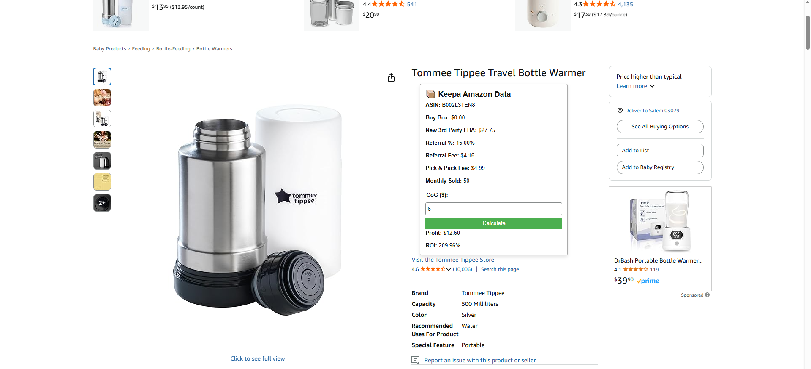

# Amazon Profit ROI Calculator

This is a Chrome Extension that displays Keepa data (Buy Box, FBA price, Referral Fee, etc.) directly on Amazon product pages. You can calculate Profit & ROI in this extension.

## How to use
1. Clone/download the repo
2. Open the folder -> go to background.js and replace your API key -> Save
3. Open Chrome → Extensions → Load unpacked → Select this folder
4. Visit an Amazon product page

## Example

